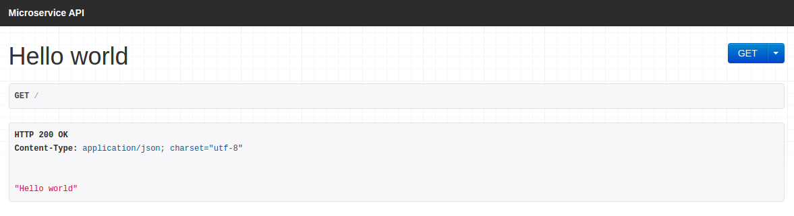
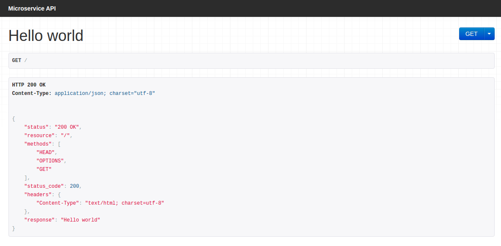
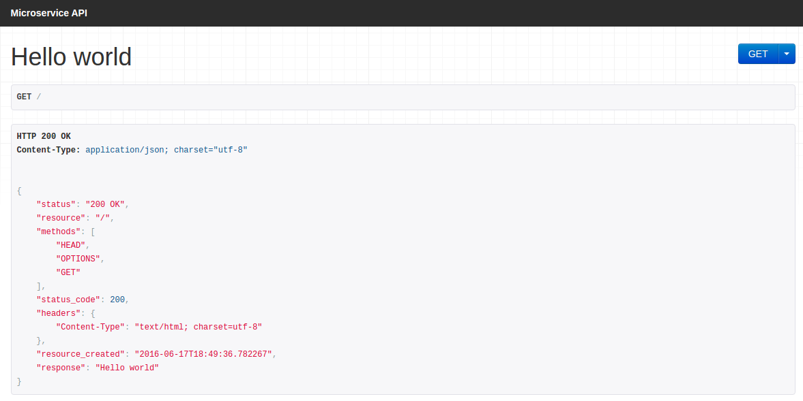
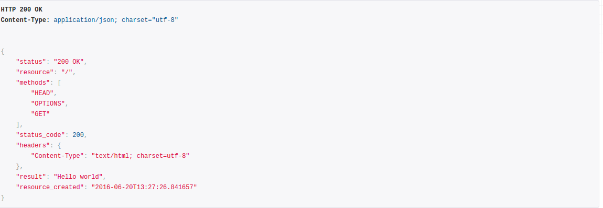
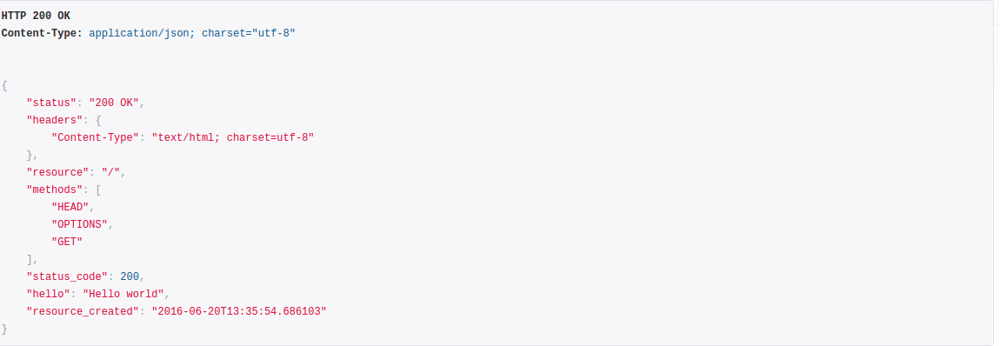
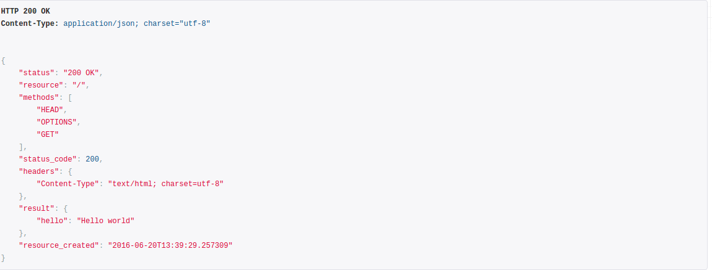
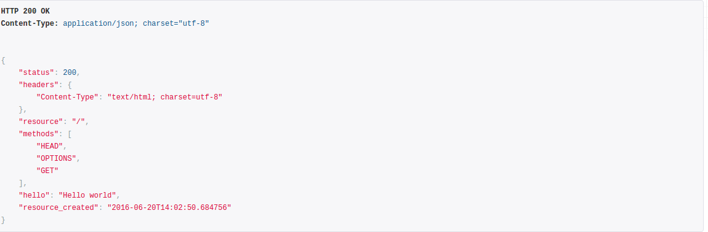
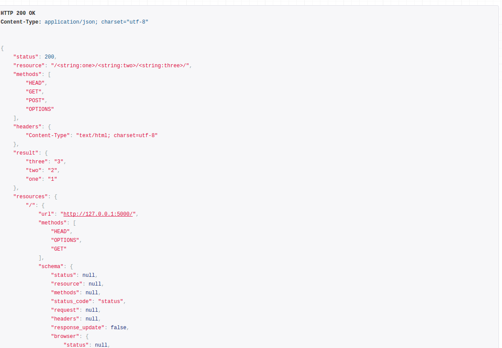
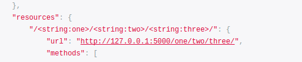

# HTTP Microservice

## Flask-API

HTTP implementation of microservices based on Flask-API

```
from microservices.http.service import Microservice

app = Microservice(__name__)
```

Where `app` - is a standard flask-api application

You can add route, how in the flask-api

```
@app.route('/')
def hello_world():
    return 'Hello world'
```

And run in debug mode

```
if __name__ == '__main__':
    app.run(debug=True)
```

Start app:

```
python hello_world.py
```

You will see in console:

```
 * Running on http://127.0.0.1:5000/ (Press CTRL+C to quit)
 * Restarting with stat
 * Debugger is active!
 * Debugger pin code: 301-234-464
```

Let's open http://127.0.0.1:5000/ in browser

You will see:



This is a standard browsable page for api, generated by flask-api

## ResourceMarker

Let's add ResourceMarker to function hello_world
```
from microservices.http.resources import ResourceMarker
```

```
@app.route(
    '/',
    resource=ResourceMarker(),
)
def hello_world():
    return 'Hello world'
```

After reload page you will see


You can see additional information

* status
* resource
* methods
* status_code
* headers
* response

As you can see, dictionary returned, and "Hello world" in key "response".
This default behavior.

Let's change it.

Add dictionary for update response

```
resource=ResourceMarker(
    update={
        'resource_created': datetime.datetime.now().isoformat()
    },
)
```

Reload a page



New key "resource_created" in response. If you try reload page again, datetime will
not changed. This is static information for resource.

Note:
> status, resource, methods, status_code, headers you will see only in browser, if you
> run curl or another http client, not browser, you will see only "response" and "update"
> dictionary, like this:
> ```
> {"response": "Hello world", "resource_created": "2016-06-17T18:49:36.782267"}
> ```

## ResourceSchema

Ok, let's do more customizations! And use ResourceSchema

Importing `ResourceSchema` from `microservices.http.resources`
```
from microservices.http.resources import ResourceMarker, ResourceSchema
```

And change something, ex. response name
```
    schema=ResourceSchema(
        response='result',
    )
```

Let's see
```
resource=ResourceMarker(
    update={
        'resource_created': datetime.datetime.now().isoformat()
    },
    schema=ResourceSchema(
        response='result',
    )
)
```



Was `"respone": "Hello world"` and now `"result": "Hello world"`

Want a more? OK!

If your response is a dict, by default response will be updated from your response

```
def hello_world():
    return {'hello': 'Hello world'}
```



If you want reponse all data in your response key name, you can change a policy:

```
resource=ResourceMarker(
    update={
        'resource_created': datetime.datetime.now().isoformat()
    },
    schema=ResourceSchema(
        response='result',
        response_update=False,
    )
),
```

And you will see:
```
"result": {
    "hello": "Hello world"
},
```



By default for non-browser clients technical information (as status, headers, url) will be ignored.
You can change this and rename response keys

Lets importing `BrowserResourceSchema`
```
from microservices.http.resources import ResourceMarker, ResourceSchema, BrowserResourceSchema
```

And add some modifications:
```
resource=ResourceMarker(
    update={
        'resource_created': datetime.datetime.now().isoformat()
    },
    schema=ResourceSchema(
        response='result',
        response_update=False,
        status_code='status',
        browser=BrowserResourceSchema(
            status=None,
        )
    )
),
```

In browser you will see



Was `status_code` - now - `status`

In real client you will see:

```
{"status": 200, "result": {"hello": "Hello world"}, "resource_created": "2016-06-20T14:02:50.684756"}
```

## Settings

If you want use your custom ResourceSchema everywhere, you can change default
settings.

It is easy:

```
app.config['SCHEMA'] = ResourceSchema(
    response='result',
    response_update=False,
    status_code='status',
    browser=BrowserResourceSchema(
        status=None,
    )
)
```

```
resource=ResourceMarker(
    update={
        'resource_created': datetime.datetime.now().isoformat()
    }
)
```

## More resources

Let's add new resource

```
from flask import request
```

```
@app.route(
    '/<string:one>/<string:two>/<string:three>/',
    methods=['GET', 'POST'],
    resource=ResourceMarker()
)
def one_two_three(one, two, three):
    response = {'one': one, 'two': two, 'three': three}
    if request.method == 'POST':
        response['data'] = request.data
    return response
```

Let's open in browser [http://localhost:5000/1/2/3/](http://localhost:5000/1/2/3/)



In response added field - `resources`

This is a information about all resources in Microservice.
You can see `url` (clickable), `methods` and `schema`

If you open [http://localhost:5000](http://localhost:5000)
You will see information about resource `"/<string:one>/<string:two>/<string:three>/"`

Where `url`? Not found, because microservice don't know how to create url dynamically,
but you know, and you can say microservice how to create url

Let's do it
```
@app.route(
    '/<string:one>/<string:two>/<string:three>/',
    methods=['GET', 'POST'],
    resource=ResourceMarker(
        url_params={'one': 'one', 'two': 'two', 'three': 'three'}
    )
)
def one_two_three(one, two, three):
```
Result:



## Client

Let's write a client for our microservice

Create a `hello_world_client.py`

And add this code
```
from microservices.http.client import Client

hello_world = Client('http://localhost:5000')

response = hello_world.get()
print(response)
```

and run it `python hello_world_client.py`

You will see
```
{u'status': 200, u'result': {u'hello': u'Hello world'}, u'resource_created': u'2016-06-20T17:51:22.358575'}
```

If you want get a result, u can use `key` in method get

```
response = hello_world.get(key='result')
```

You will see
```
{u'hello': u'Hello world'}
```

What, if key not found?

```
response = hello_world.get(key='bad_key')
```

Will generated an exception `microservices.http.client.ResponseError`

Ex.
```
Traceback (most recent call last):
  File "/home/viator/coding/code/microservices/examples/http/hello_world_client.py", line 5, in <module>
    response = hello_world.get(key='bad_key')
  File "/home/viator/coding/code/microservices/microservices/http/client.py", line 89, in __call__
    return self.client.handle_response(response, response_key=response_key)
  File "/home/viator/coding/code/microservices/microservices/http/client.py", line 198, in handle_response
    raise ResponseError(response, 'Response key not found!')
microservices.http.client.ResponseError: Error status code: 200. Description: Response key not found!
```

What we can get from exception?

```
from microservices.http.client import Client
from microservices.http.client import ResponseError
from six import print_

hello_world = Client('http://localhost:5000')

try:
    response = hello_world.get(key='bad_key')
except ResponseError as error:
    print_('Data:', error.response.json())
    print_('Status code:', error.status_code)
    print_('Description:', error.description)
    print_('Content:', error.content)
```

Answer:
```
Data: {u'status': 200, u'result': {u'hello': u'Hello world'}, u'resource_created': u'2016-06-20T17:51:22.358575'}
Status code: 200
Description: Response key not found!
Content: {"status": 200, "result": {"hello": "Hello world"}, "resource_created": "2016-06-20T17:51:22.358575"}
```

You can use ResponseError in your code for easy handling errors

What can the Client yet?

Any http methods, like a post, get, delete, patch, put etc...

Let's test a POST method

We can create a new resource from Client
```
one_two_three = hello_world.resource('one', 'two', 'three')
```
Where `'one', 'two', 'three'` => `http://localhost:5000/one/two/three/`

Let's see how it works:

```
one_two_three = hello_world.resource('one', 'two', 'three')
response = one_two_three.post(data={'post': 'test'})
print_(response)
result = one_two_three.post(data={'post': 'test'}, key='result')
print_(result)
```

Result:
```
{u'status': 200, u'result': {u'one': u'one', u'data': {u'post': u'test'}, u'three': u'three', u'two': u'two'}}
{u'one': u'one', u'data': {u'post': u'test'}, u'three': u'three', u'two': u'two'}
```

You can write your Client class, where override method `handle_response` for customization