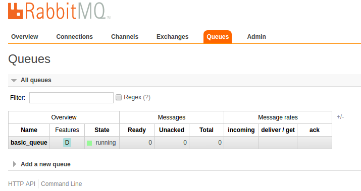
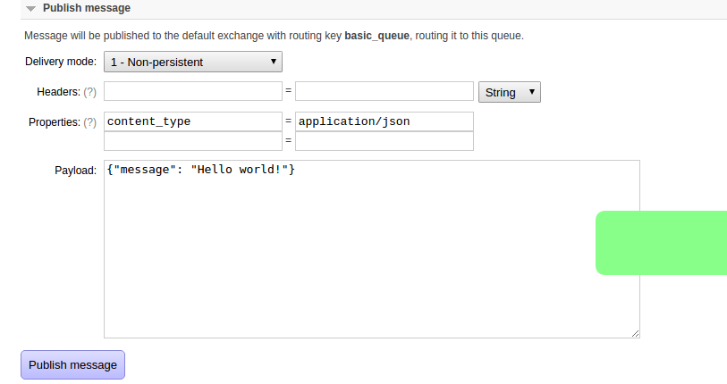

# Queue Microservice

## Kombu

Queue implementation of microservices based on kombu

```python
from microservices.queues.service import Microservice

app = Microservice()
```

Where `app` - is a queue reader service

Basic usage:
```python
@app.queue('basic_queue')
def hello_world(payload, context):
    print(payload)
```

And run it

```python
if __name__ == '__main__':
    app.run(debug=True)
```

Start app:

```
python hello_world_queue.py
```

You will see in console:

```
2016-08-31 12:45:48,182 - amqp - DEBUG - Start from server, version: 0.9, properties: {'version': '3.5.7', 'cluster_name': 'rabbit@viator-acronis', 'information': 'Licensed under the MPL.  See http://www.rabbitmq.com/', 'copyright': 'Copyright (C) 2007-2015 Pivotal Software, Inc.', 'product': 'RabbitMQ', 'platform': 'Erlang/OTP', 'capabilities': {'consumer_cancel_notify': True, 'exchange_exchange_bindings': True, 'connection.blocked': True, 'basic.nack': True, 'publisher_confirms': True, 'authentication_failure_close': True, 'per_consumer_qos': True, 'consumer_priorities': True}}, mechanisms: ['AMQPLAIN', 'PLAIN'], locales: ['en_US']
2016-08-31 12:45:48,182 - amqp - DEBUG - Open OK!
2016-08-31 12:45:48,182 - amqp - DEBUG - using channel_id: 1
2016-08-31 12:45:48,183 - amqp - DEBUG - Channel open
```

Run rabbit mq admin panel (`rabbitmq-plugins enable rabbitmq_management`)

And open [http://localhost:15672/#/queues]() in browser (default login/pass: guest:guest)

You will see:



This is a standard rabbitmq admin panel

Let's publish something to basic_queue

Go to: [http://localhost:15672/#/queues/%2F/basic_queue]()

And publish message "Hello, world!"


In console output you will see:
`Hello, world!`

Good. Let's send json.

Use property `content_type` with value `application/json`

Send json string: `{"message": "Hello, world!"}`



In console output you will see:
`{'message': 'Hello, world!'}` - repr for python dict

## Client

Let's write a client for our microservice

Create a `hello_world_client.py`

And add this code
```python
from microservices.queues.client import Client

client = Client()

q = client.queue('basic_queue')

q.publish({"message": "Hello, world!"})
```

and run it `python hello_world_client.py`

In service console you will see
`{'message': 'Hello, world!'}`

## Production

Microservice app - this is a instance with method `app.run()`, which start as infinity loop.
Infinity loop - gevent compatible.

If you need use your loop, you can use `app.handle_connections()` in your loop.

Microservices library provide you runners for help deployment.

### Gevent

```python
from microservices.queues.runners import gevent_run
from basic import app
from microservices.utils import set_logging
import gevent

set_logging()

gevent_run(app)

while True:
    gevent.idle()
```

### Workers and thread pool

Run service with handling messages in thread pool

```python

from microservices.queues.service import Microservice

app = Microservice(workers=10)
```

```python

from microservices.queues.service import Microservice
from gevent.pool import Pool

app = Microservice(workers=10, pool_factory=Pool)
```

P.S. Queues is a simple!
